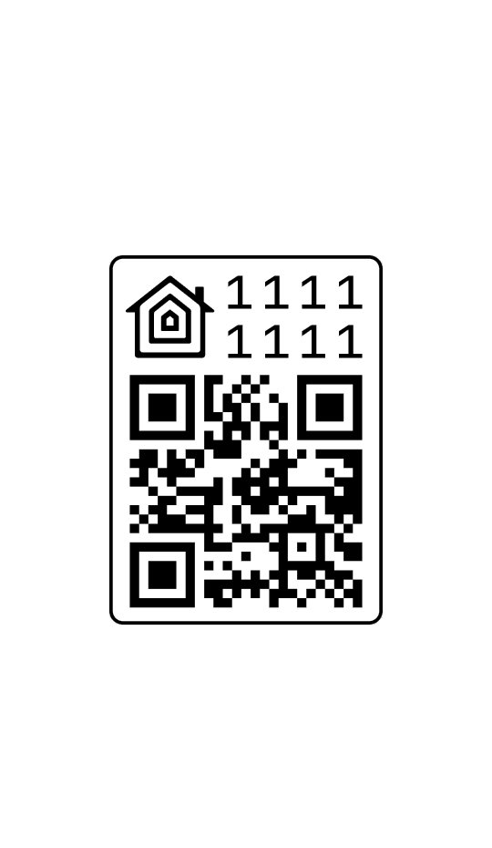
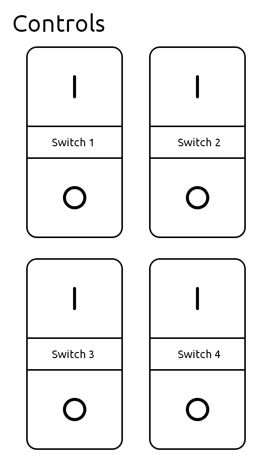
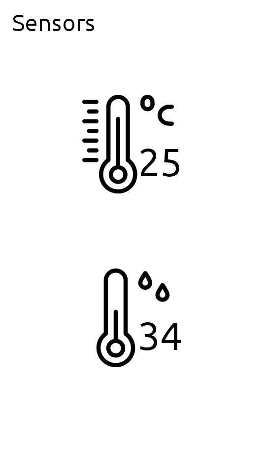
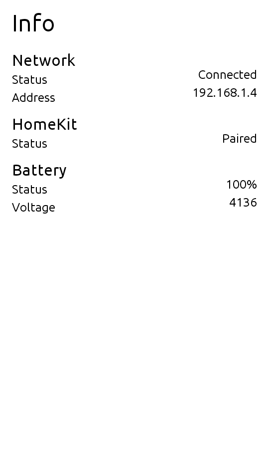

# M5Paper HomeKit Switch

HomeKit Programmable Switch for the [M5Paper](https://docs.m5stack.com/en/core/m5paper_v1.1)

# Features

...

# Screenshots

# Requirement

- [PlatformIO](https://platformio.org)

# Installation

Build it from source code and upload it to your M5Paper using PlatformIO

# Usage

| Jog Dial        | Description                        |
| --------------- | ---------------------------------- |
| Up              | Display Controls / HomeKit Pairing |
| Press           | Display Info                       |
| Press Long (3s) | Deep Sleep / Wake Up               |
| Down            | Display Sensors                    |
| Up Hold (15s)   | Reset                              |

# Note

This project is based on the https://github.com/Ry0/M5PaperMultiDimmerSwitch source code and pretty much still work in progress..

Images are converted using following tool https://lvgl.io/tools/imageconverter (LV_IMG_CF_INDEXED_4BIT)

# License

M5Paper HomeKit Switch is under [MIT license](./LICENSE)
